## Training-Data Segments

If we take a look at the training data variables (`acoustic_data` and `time_to_failure`):

we can see that there are 15 segments; each segment contains a fault (where `time_of_failure` reaches 0). 

The following images show the segments of the training data; each segment in an image. Note that all images have the same y-axis which makes comparison easier.

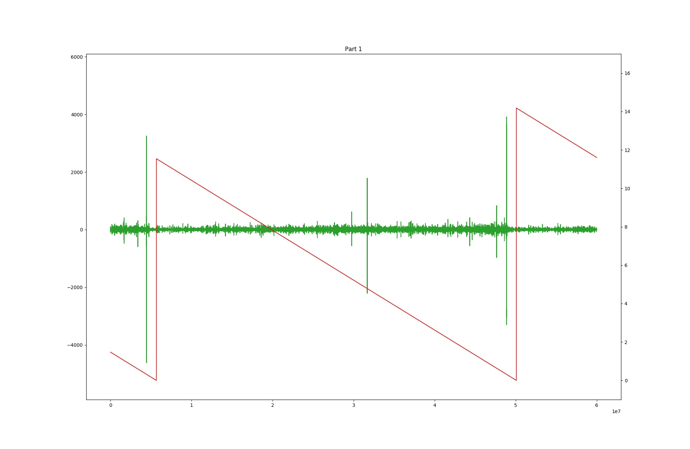

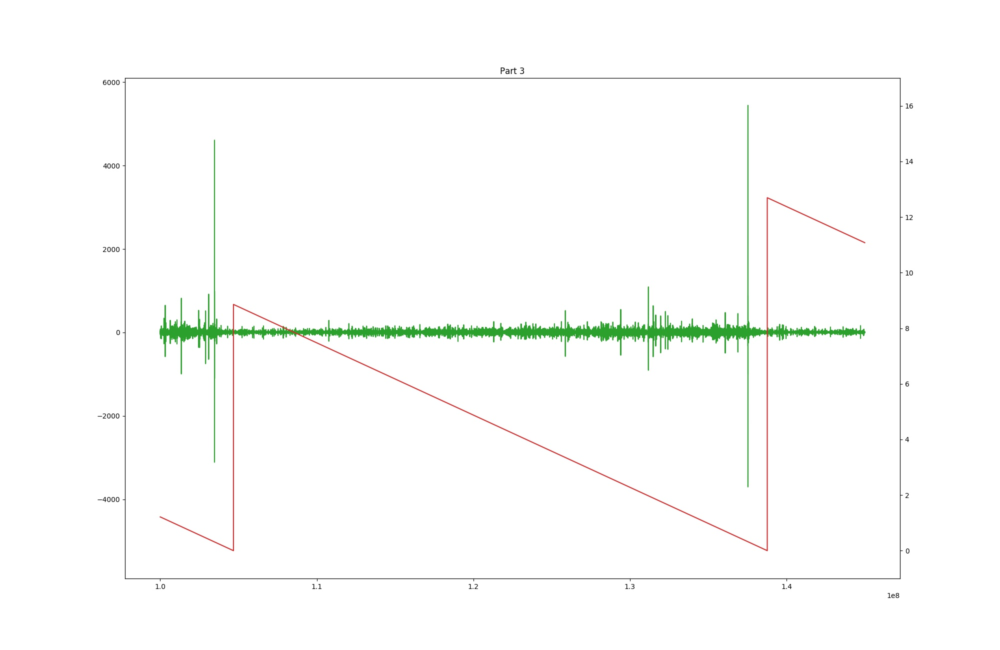
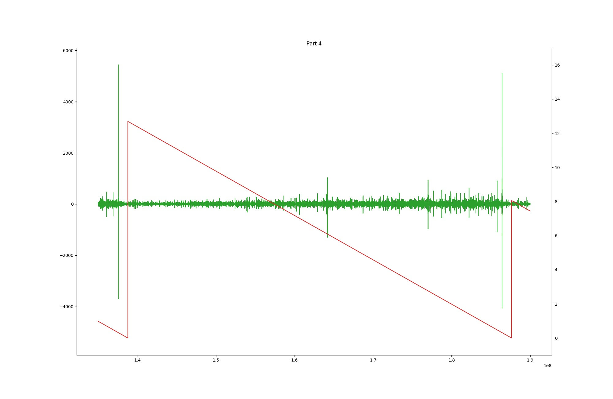
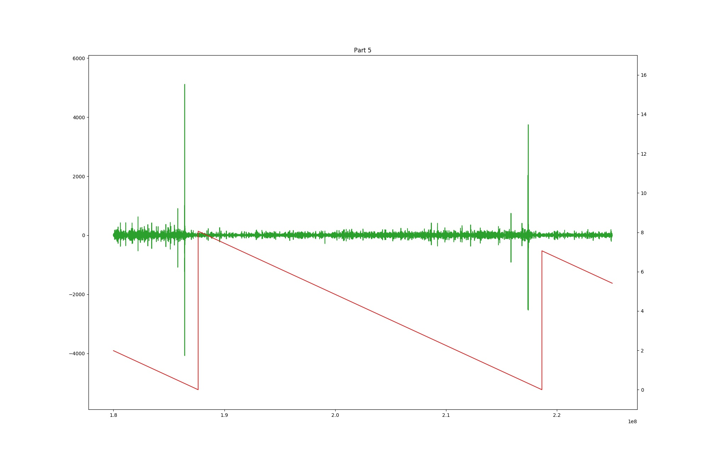
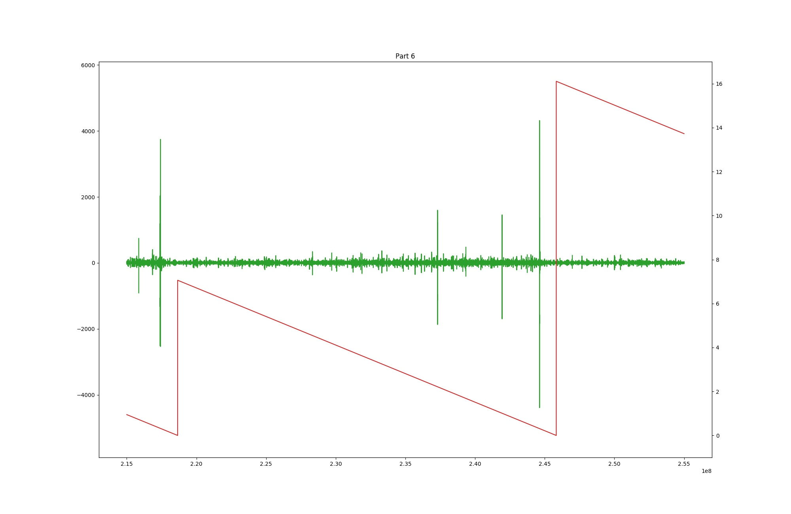
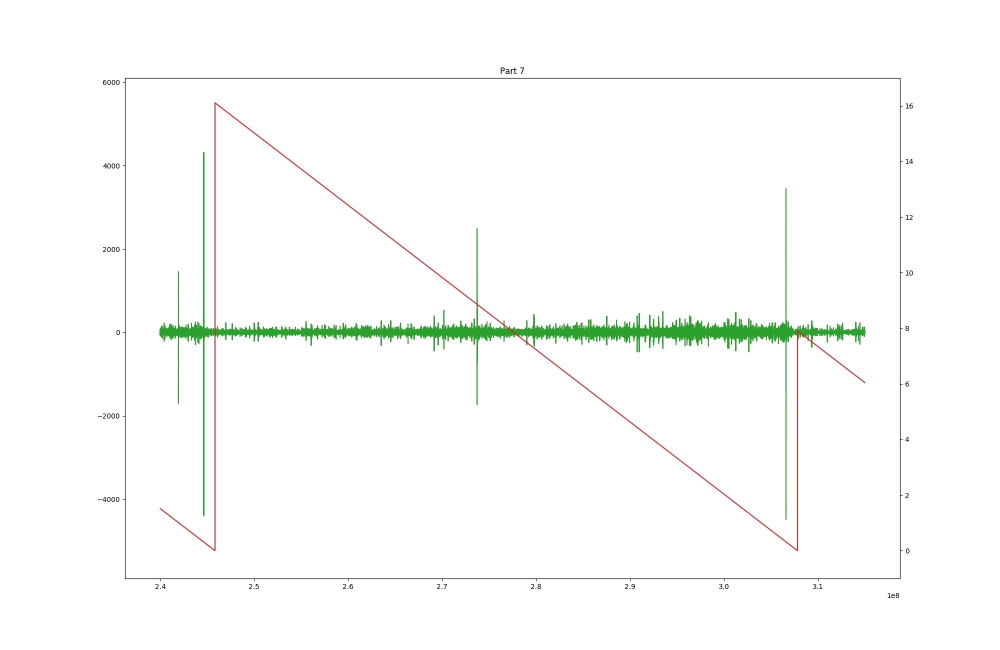
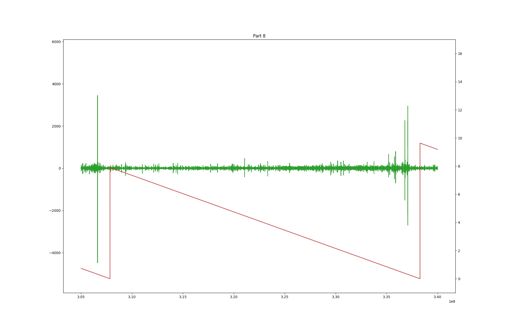

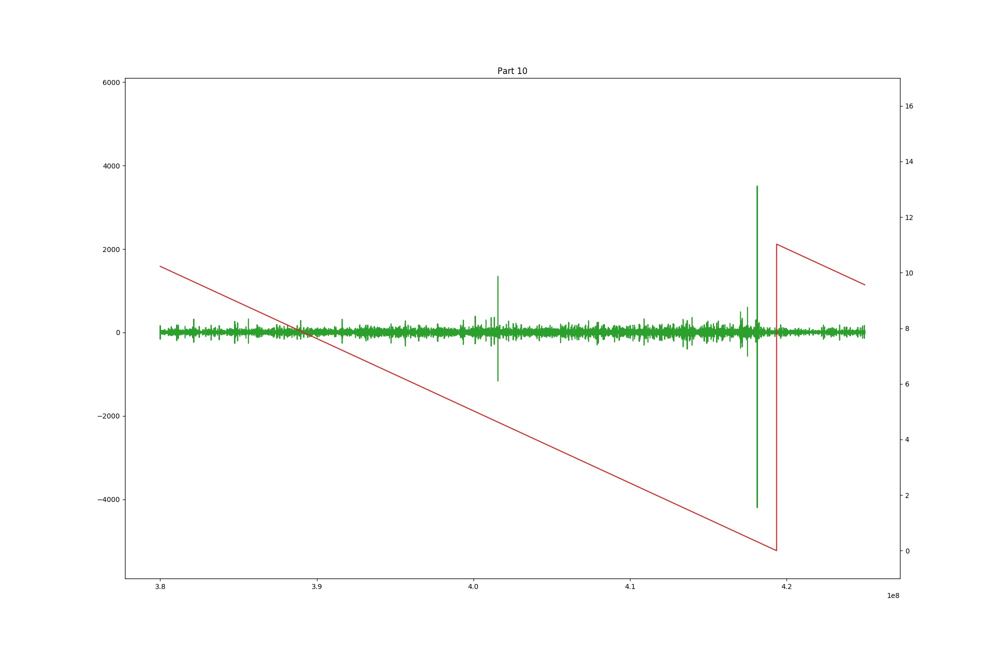
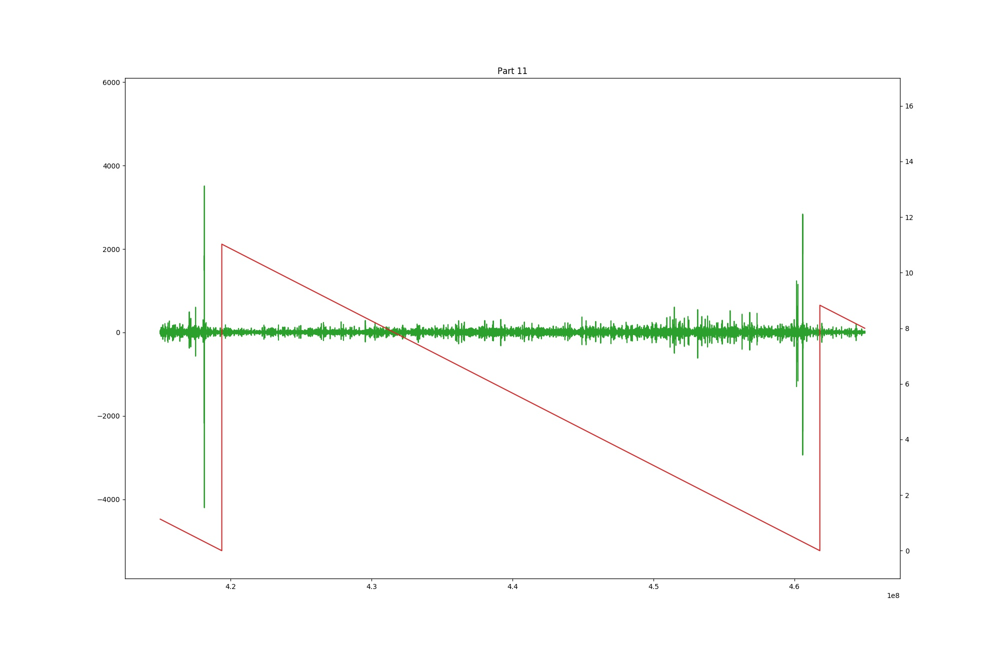
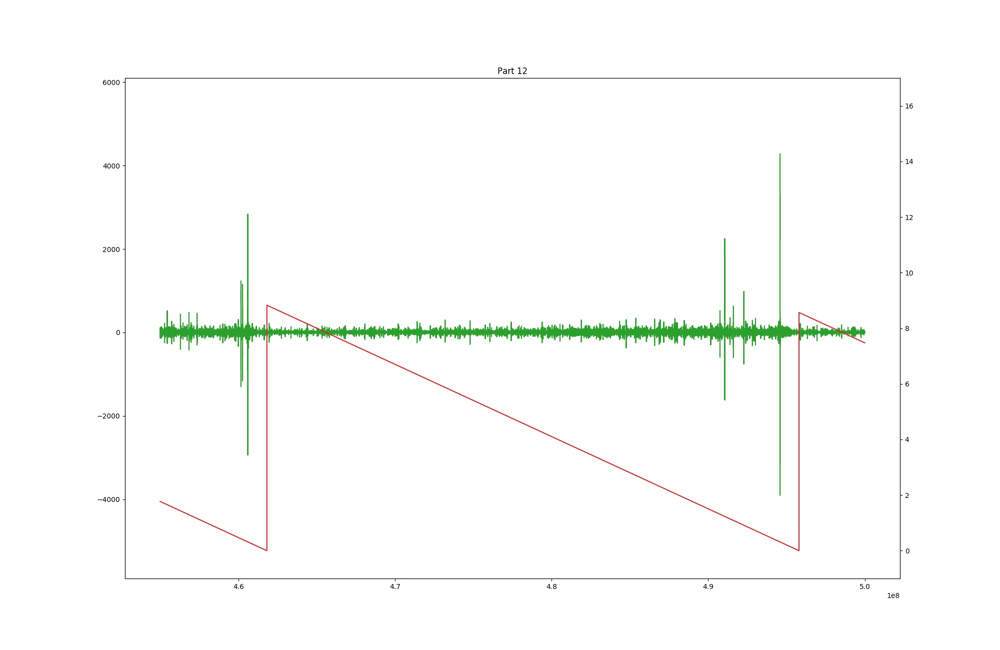
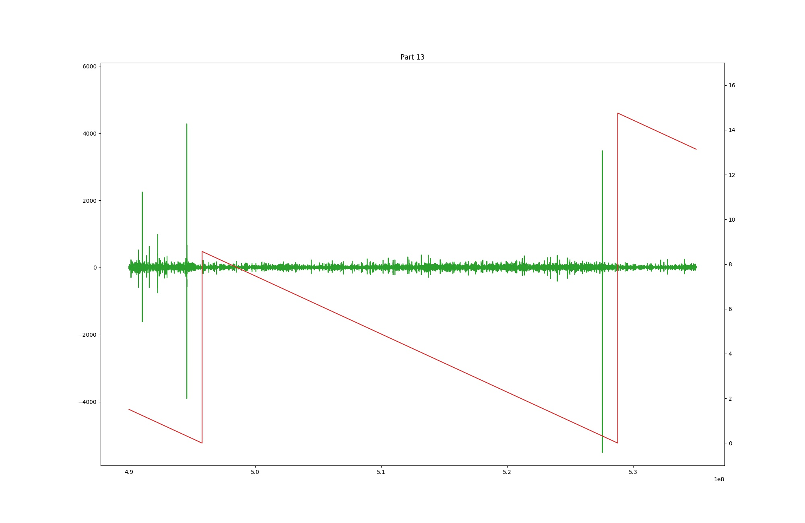
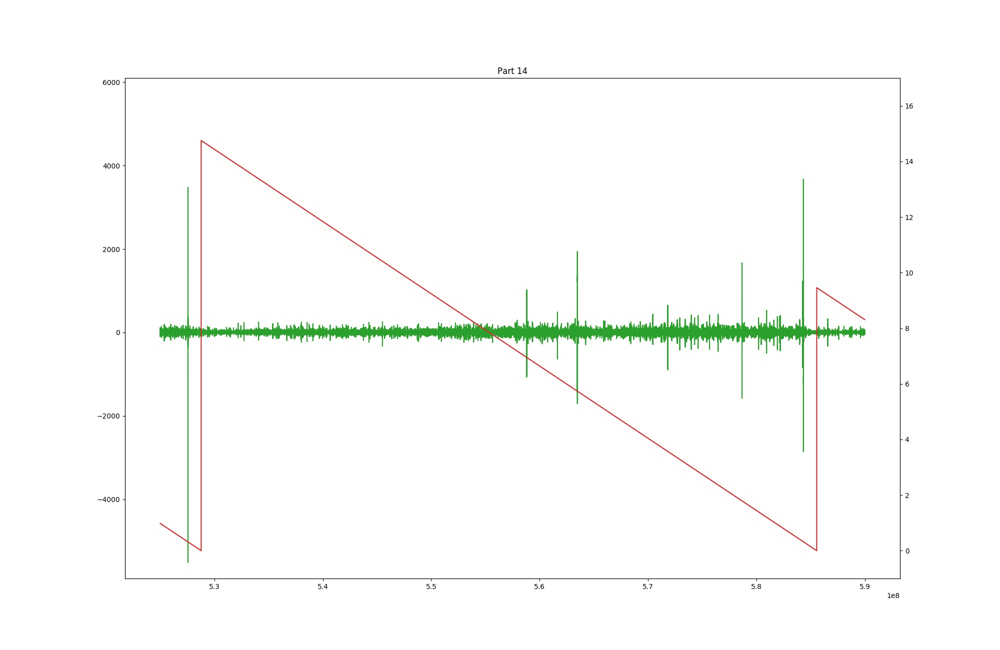
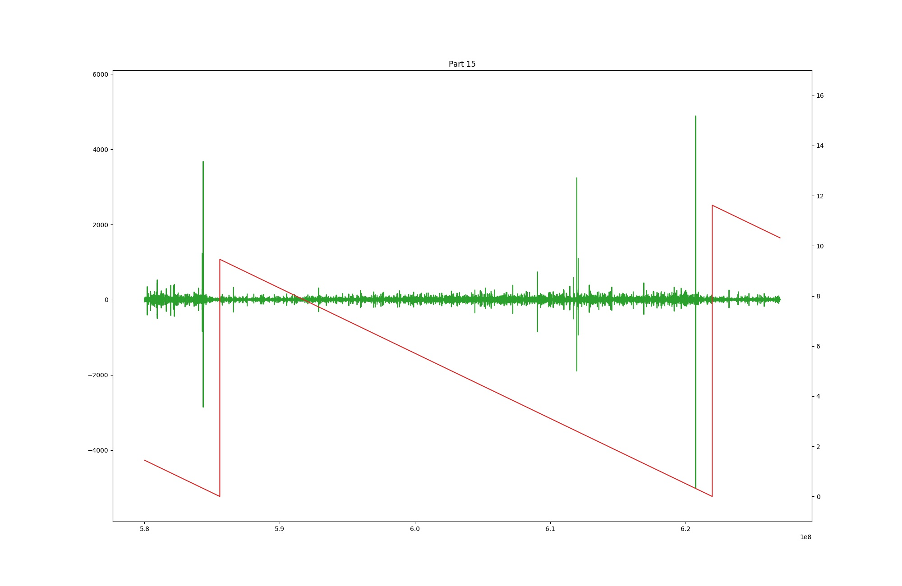

